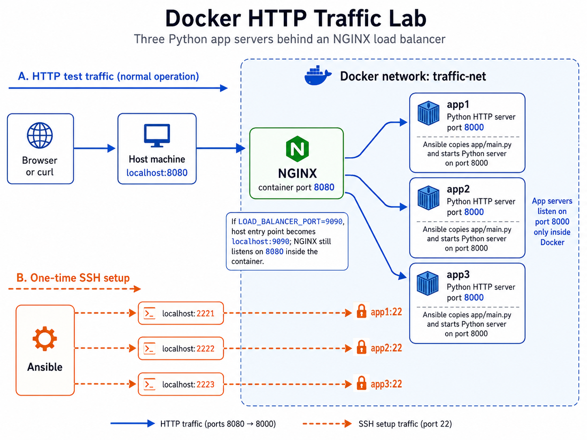

# Docker HTTP Traffic Lab

This project runs three Python HTTP app servers behind an NGINX load balancer.
The diagram shows two separate connection paths: normal **HTTP traffic** and
one-time **SSH setup** traffic.



## 1. HTTP: browser → NGINX → app server

Use this path when you want to send test traffic:

```text
Browser or curl → localhost:8080 → NGINX:8080 → app1/app2/app3:8000
```

- Open `http://localhost:8080/` on your computer.
- Docker sends host port `8080` into the NGINX container's port `8080`.
- NGINX chooses one app server and forwards the request through the internal
  Docker network, `traffic-net`.
- The app servers listen on port `8000` only inside Docker. You do not connect
  to `localhost:8000` directly.
- NGINX sends the app's response back to your browser or `curl` command.

`LOAD_BALANCER_PORT=9090` changes the host entry point to
`http://localhost:9090/`; NGINX still uses port `8080` inside its container.

Each response shows the selected server in both its body and the
`X-Served-By` response header. To observe NGINX's round-robin selection:

```bash
for i in {1..9}; do curl -s http://localhost:8080/; done
```

The output should cycle through `app1`, `app2`, and `app3` while all three
servers are healthy. Use `curl -i http://localhost:8080/` to see the
`X-Served-By` header. Each app also writes its name into its request log.

## 2. SSH: Ansible → app server setup

Use this path only when preparing the app servers. It is not used by browser
requests.

```text
Ansible → localhost:2221/2222/2223 → container SSH port :22 → start Python server :8000
```

| Ansible connects to | Docker forwards to | Container |
| --- | --- | --- |
| `localhost:2221` | `app1:22` | app1 |
| `localhost:2222` | `app2:22` | app2 |
| `localhost:2223` | `app3:22` | app3 |

- SSH uses the standard server port `22` inside every app container.
- Ansible reads `ansible/inventory.ini`, connects using SSH, copies
  `app/main.py`, and starts it on port `8000`. It also gives each process its
  server name (`app1`, `app2`, or `app3`) for the HTTP response and logs.
- `docker/docker-compose.yaml` defines the port mappings such as `2221:22`.
  Read it as **your computer's port 2221 → app1's port 22**.
- `docker/Dockerfile.virtual-server` runs the SSH server (`sshd`) and accepts
  Ansible's SSH key.

Start the containers, then run the setup playbook:

```bash
docker compose -f docker/docker-compose.yaml up --build -d
ansible-playbook -i ansible/inventory.ini ansible/playbook.yaml
```

After setup, send HTTP requests to NGINX on `localhost:8080`; you do not need
to use SSH again unless you want to reconfigure the app servers.
