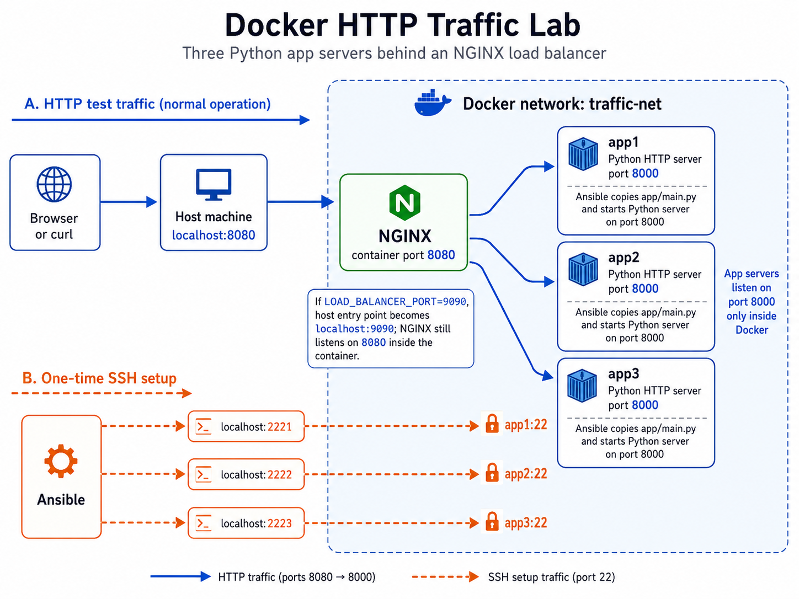

# Docker HTTP Traffic Lab

This project runs three Python HTTP app servers behind an NGINX load balancer.
The diagram shows two separate connection paths: normal **HTTP traffic** and
one-time **SSH setup** traffic.



## 1. HTTP: browser → NGINX → app server

Use this path when you want to send test traffic:

```text
Browser or curl → localhost:8080 → NGINX:8080 → app1/app2/app3:8000
```

- Open `http://localhost:8080/` on your computer.
- Docker sends host port `8080` into the NGINX container's port `8080`.
- NGINX chooses one app server and forwards the request through the internal
  Docker network, `traffic-net`.
- The app servers listen on port `8000` only inside Docker. You do not connect
  to `localhost:8000` directly.
- NGINX sends the app's response back to your browser or `curl` command.

`LOAD_BALANCER_PORT=9090` changes the host entry point to
`http://localhost:9090/`; NGINX still uses port `8080` inside its container.

Each response shows the selected server in both its body and the
`X-Served-By` response header. To observe NGINX's round-robin selection:

```bash
for i in {1..9}; do curl -s http://localhost:8080/; done
```

The output should cycle through `app1`, `app2`, and `app3` while all three
servers are healthy. Use `curl -i http://localhost:8080/` to see the
`X-Served-By` header. Each app also writes its name into its request log.

## 2. SSH: Ansible → app server setup

Use this path only when preparing the app servers. It is not used by browser
requests.

```text
Ansible → localhost:2221/2222/2223 → container SSH port :22 → start Python server :8000
```

| Ansible connects to | Docker forwards to | Container |
| --- | --- | --- |
| `localhost:2221` | `app1:22` | app1 |
| `localhost:2222` | `app2:22` | app2 |
| `localhost:2223` | `app3:22` | app3 |

- SSH uses the standard server port `22` inside every app container.
- Ansible reads `ansible/inventory.ini`, connects using SSH, copies
  `app/main.py`, and starts it on port `8000`. It also gives each process its
  server name (`app1`, `app2`, or `app3`) for the HTTP response and logs.
- `docker/docker-compose.yaml` defines the port mappings such as `2221:22`.
  Read it as **your computer's port 2221 → app1's port 22**.
- `docker/Dockerfile.virtual-server` runs the SSH server (`sshd`) and accepts
  Ansible's SSH key.

Start the containers, then run the setup playbook:

```bash
docker compose -f docker/docker-compose.yaml up --build -d
ansible-playbook -i ansible/inventory.ini ansible/playbook.yaml
```

After setup, send HTTP requests to NGINX on `localhost:8080`; you do not need
to use SSH again unless you want to reconfigure the app servers.

## 3. The same architecture on EC2

The EC2 deployment mirrors the local one: the same NGINX container balances the
same app containers. Only the entry points differ.

```text
Mac (curl / hey) → EC2:8080 → nginx:8080 → app1..appN:8000
Mac (ansible)    → EC2:22   → SSH jump   → 127.0.0.1:222N → container:22
```

The container SSH ports are bound to the EC2 host's loopback interface, so
Ansible reaches them by jumping through the EC2 host. The security group only
needs to open port `22` and port `8080`, and the container SSH key never leaves
your Mac.

### Division of responsibility

| Layer | Tool | What it does |
| --- | --- | --- |
| VPC, subnet, security group, instance | Terraform | `ec2/terraform/` |
| Docker, Compose, containers, application | Ansible | `ansible/playbook_ec2.yaml` |

Terraform creates a plain, empty instance and stops there; it has no
`user_data` at all. Everything above the operating system is Ansible's job, so
you can rebuild the architecture in seconds without touching Terraform and
without waiting for a new instance to boot.

### Deploy

```bash
# 1. Provision the instance
terraform -chdir=ec2/terraform apply

# 2. Build the architecture on it
export EC2_HOST=$(terraform -chdir=ec2/terraform output -raw public_ip)
ansible-playbook -i ansible/inventory_ec2.yaml ansible/playbook_ec2.yaml
```

The SSH key at `ssh_public_key_path` has no passphrase, so neither Terraform
nor Ansible needs `ssh-agent`. Terraform registers the public half with EC2,
and the instance accepts it on first boot.

The playbook ends by sending requests through NGINX and asserting that every
app server appears in the rotation, so a successful run means the architecture
is verified end to end.

### Send traffic and read the metrics

```bash
curl -i "http://$EC2_HOST:8080/"
hey -z 60s -c 20 "http://$EC2_HOST:8080/download?mb=1"
```

Then read `NetworkIn`, `NetworkOut`, `NetworkPacketsIn`, `NetworkPacketsOut`,
`CPUUtilization`, and `CPUCreditBalance` under CloudWatch → EC2 → Per-Instance
Metrics.

### Changing the number of app servers

`app_count` in `ansible/inventory_ec2.yaml` is the single knob. It drives the
Compose file, the NGINX upstream list, and the SSH port assignments, all of
which are rendered from templates in `ansible/templates/`:

```bash
ansible-playbook -i ansible/inventory_ec2.yaml ansible/playbook_ec2.yaml -e app_count=5
```

This is the variable the ML autoscaling experiment is meant to optimise: too
many containers wastes the instance, too few cannot absorb the traffic.

> `t4g.nano` has 0.5 GB of RAM, which is enough for the default three app
> servers but leaves little room to scale up. If the image build or the
> containers run out of memory, set `instance_type = "t4g.small"` in
> `ec2/terraform/terraform.tfvars` and re-apply.

### If your home IP changes

The security group only admits `my_ip_cidr`. When your IP changes, SSH and HTTP
both hang:

```bash
curl -s https://checkip.amazonaws.com   # update my_ip_cidr in terraform.tfvars
terraform -chdir=ec2/terraform apply    # updates the security group in place
```
